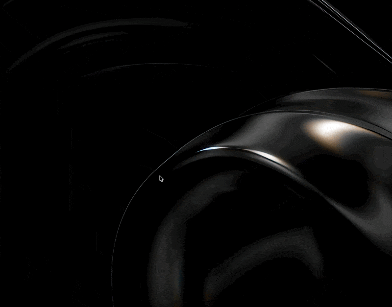

<p align="center">
  
</p>

<h1 align="center">Remora</h1>

<p align="center">
  A small performance HUD that rides along on whatever app you are using.<br>
  Free, open source, AppKit only.
</p>

<p align="center">
  <a href="#install">Install</a> ·
  <a href="#features">Features</a> ·
  <a href="#permissions">Permissions</a> ·
  <a href="#configuration">Configuration</a> ·
  <a href="#how-the-numbers-are-computed">How the numbers are computed</a> ·
  <a href="#build-from-source">Build</a>
</p>

<p align="center">
  <a href="https://github.com/adilrc/Remora/releases/latest"></a>
  <a href="https://github.com/adilrc/Remora/releases"></a>
  
  <a href="LICENSE"></a>
</p>

<p align="center">
  
</p>

Remora is named after the fish that hitches a ride on bigger fish. It attaches a tiny glass HUD to the corner of the frontmost window and shows what that app is costing you right now: CPU, memory, Activity Monitor's Energy Impact and 12 hr Power, and how long the app took to launch. When you switch apps, the HUD follows.

## Features

**Follows the window you are using**

- **Attaches to the frontmost window.** The HUD tracks the focused window of the active app, moves with it, and hides when there is nothing to attach to.
- **Six anchor positions.** Drag the HUD to any corner or edge of the window and it snaps into place, with a haptic tick as it passes each anchor.
- **Or detach it.** Pop the HUD out to a fixed spot on screen when you want it out of the way, then re-attach with one click.

**Shows what that app is costing**

- **CPU and memory** for the app and its helper processes, not just the main process.
- **Energy Impact and 12 hr Power,** the same numbers Activity Monitor shows, so you can compare directly.
- **Launch Timer, Time to Interactive, and experimental Visually Complete,** for apps started while Remora is running.
- **Colour thresholds you control.** Values turn orange and red at levels you set.

**Stays out of the way**

- **Menu bar only.** No Dock icon, no windows unless you open Settings.
- **Global hotkey** to show or hide the HUD, `⌃⌥H` by default.
- **Drag to reorder** metrics, right-click to toggle them, and everything persists.
- **Plain-text configuration** in `~/.config/remora/config`, reloaded as you edit it.

## Install

With [Homebrew](https://brew.sh):

```sh
brew install --cask adilrc/tap/remora
```

Or download the latest `Remora-<version>.zip` from [Releases](https://github.com/adilrc/Remora/releases/latest), unzip it, and move `Remora.app` to your Applications folder. Builds are signed and notarized, so macOS opens them without a warning.

Remora needs macOS 14 or later. It checks for new versions once a day and offers to install them; the "Check for Updates…" item in its menu does the same on demand.

## Permissions

| Permission | What it enables | When Remora asks |
|---|---|---|
| Accessibility | Reading the frontmost window's position and size so the HUD can follow it, and detecting the focused text field for Time to Interactive. | On first launch, through an onboarding window that opens the right System Settings pane and lets you drag the app in. |
| Screen Recording | Capturing window frames for the optional Visually Complete experiment. | Only when Visually Complete is enabled. |

On macOS 27 the Accessibility pane is called "Device Control and Data Access"; it is the same permission.

## Configuration

Everything lives in a `key = value` file at `~/.config/remora/config` (or `$XDG_CONFIG_HOME/remora/config`). Remora creates it on first launch, keeps your comments and unknown keys when Settings changes a value, and reloads it when you edit it by hand.

```ini
# Remora configuration
hud-position = bottom-right
hud-detached = false
hud-detached-position = none
metric-order = cpu,memory,energy-impact,twelve-hour-power,launch-timer,time-to-interactive,visually-complete
show-cpu = true
show-memory = true
show-energy-impact = true
show-twelve-hour-power = true
show-launch-timer = true
show-time-to-interactive = true
show-visually-complete = false
cpu-orange-threshold = 40
cpu-red-threshold = 80
energy-impact-orange-threshold = 100
energy-impact-red-threshold = 200
toggle-shortcut = ctrl+alt+h
```

| Key | Values |
|---|---|
| `hud-position` | `top-left`, `top`, `top-right`, `bottom-left`, `bottom`, `bottom-right` |
| `hud-detached` | `true` keeps the HUD at a fixed screen position instead of following the window |
| `hud-detached-position` | `x,y` in screen points, or `none` |
| `metric-order` | Comma-separated metric names in display order |
| `show-*` | `true` or `false` per metric |
| `*-threshold` | Value at which the metric turns orange or red |
| `toggle-shortcut` | Modifiers `ctrl`, `alt`, `shift`, `cmd` plus a key, or `none` to disable |

## How the numbers are computed

- **CPU** is the CPU time of the app's process tree, sampled at a fixed interval and expressed as a percentage of one core, the way Activity Monitor does. The tree includes child processes, processes that name the app as responsible, and helpers whose executable lives inside the app bundle.
- **Memory** is the summed physical footprint of the same processes, which matches Activity Monitor's Memory column.
- **Energy Impact** is Activity Monitor's live score: CPU time, wakeups, GPU and disk activity for the app's resource coalition, weighted with the per-machine coefficients in `/usr/share/pmenergy`. Ten milliseconds of CPU-equivalent work counts as one point.
- **12 hr Power** comes from the same system statistics service Activity Monitor uses for its 12 hr Power column.
- **Launch Timer** runs from the process launch until Remora sees the app's first normal on-screen window. Window creation times are not available retroactively, so only apps launched while Remora is running get a value.
- **Time to Interactive** runs from launch until the first window has an enabled, keyboard-focused text field. Apps with incomplete Accessibility support may never report one.
- **Visually Complete** starts ScreenCaptureKit after keyboard Time to Interactive, then compares rendered window pixels and reports the final meaningful change before 750 ms of visual stability. It is therefore always later than Time to Interactive. It is off by default.

Energy Impact, 12 hr Power and part of the window tracking use private macOS interfaces. They are the same ones Activity Monitor relies on, but Apple can change them in any release. If a metric shows a dash after a macOS update, that is usually why.

## Build from source

You need macOS 14 or later, Xcode 26 or later, and [XcodeGen](https://github.com/yonaskolb/XcodeGen):

```sh
brew install xcodegen
git clone https://github.com/adilrc/Remora.git
cd Remora
make open
```

`make open` generates `Remora.xcodeproj` from `project.yml` and opens it in Xcode. `make build` does a command-line Debug build instead.

Debug builds run as "Remora Dev" with their own bundle identifier and read `~/.config/remora-dev/config`, so they never disturb an installed copy's permission grant or configuration.

Local builds are ad-hoc signed, so no developer account is needed. macOS ties the Accessibility grant to the code signature, which means an ad-hoc build has to be granted again after each rebuild. To sign with your own team, copy `resources/configuration/Signing.local.xcconfig.example` to `Signing.local.xcconfig` and fill in your team ID.

## License

[MIT](LICENSE) © 2026 Adil Erchouk
